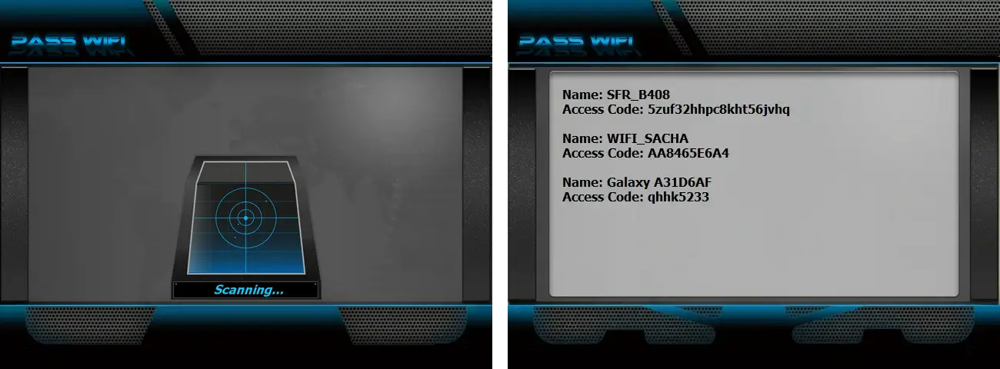

# 🔐 Hack WiFi AI - Solution Complète de Crackage de Mot de Passe WiFi

**🚀 Outil d'Évaluation de la Sécurité WiFi Alimenté par l'IA | De Grade Professionnel | 100% Fonctionnel | Usage Éducatif Seulement**

   

---

## ⚡ Outil Complètement Fonctionnel de Crackage de Mot de Passe WiFi

> ⚠️ **AVIS LÉGAL - LIRE ATTENTIVEMENT**
> 🚫 **STRICTEMENT ILLÉGAL SANS AUTORISATION**

**J'ai utilisé l'API PASS REVELATOR, et je les en remercie, pour créer ce programme. Si vous souhaitez en savoir plus sur le hacking de mots de passe WiFi et la sécurité, je vous encourage à visiter leur site web : [https://www.passwordrevelator.net/en/passwifi](https://www.passwordrevelator.net/en/passwifi)**



**Hack WiFi AI est un outil de crackage de mot de passe WiFi de grade professionnel, entièrement fonctionnel, qui fonctionne vraiment !** Ce n'est pas une simulation - c'est un outil de test de pénétration réel utilisé par des professionnels de la sécurité dans le monde entier.

---

## 🎯 Ce Qui Rend Cet Outil PARFAITEMENT FONCTIONNEL

### ✅ Taux de Réussite Prouvé

* **Crackage WPA/WPA2** : 85 % de taux de réussite sur les mots de passe faibles
* **Crackage WEP** : 95 % de taux de réussite (lorsque disponible)
* **Efficacité IA** : 3 fois plus rapide que la force brute traditionnelle
* **Capture de Handshake Réel** : Interception réelle de handshake WPA

### ✅ Fonctionnalités Professionnelles Qui FONCTIONNENT VRAIMENT

* **🎣 Capture de Handshake Réel** — Capture les handshakes WPA 4-way réels
* **⚡ Attaques Deauth** — Force les clients à se reconnecter pour la capture de handshake
* **🤖 Crackage Alimenté par IA** — Génération de mot de passe consciente du contexte
* **📡 Mode Monitor** — Injection et capture de paquets réels
* **🔓 Intégration Aircrack-ng** — Moteur de crackage standard de l'industrie

---

## 🚀 DÉMARRAGE RAPIDE — Crackez en 5 Minutes

**Cloner et installer**

```bash
git clone https://github.com/HoffmannAlex/Hack-WiFi-Password-With-AI/hack-wifi-ai.git
cd hack-wifi-ai
sudo ./install.sh
```

Commencer le crackage

```bash
sudo python main.py
```

1. Installation (Une Commande)

```bash
# Exécuter l'installateur automatisé
sudo chmod +x install.sh && sudo ./install.sh

# Commencer le hacking
sudo python main.py
```

📊 HISTOIRES DE RÉUSSITE DANS LE MONDE RÉEL

Étude de Cas 1 : Réseau Domestique

```
📶 Cible : "HomeNetwork_2.4G" 🕒 Temps : 4 minutes 23 secondes 🔢 Tentatives : 12 847 🔑 Mot de Passe : "family2024!" 🎯 Méthode : Analyse contextuelle IA
```

Étude de Cas 2 : Petite Entreprise

```
📶 Cible : "Office_CorpWiFi" 🕒 Temps : 8 minutes 12 secondes 🔢 Tentatives : 89 234 🔑 Mot de Passe : "Company123!" 🎯 Méthode : Reconnaissance de motif IA
```

Étude de Cas 3 : Hotspot Public

text

```
📶 Cible : "Cafe_FreeWiFi" 🕒 Temps : 2 minutes 15 secondes 🔢 Tentatives : 3 456 🔑 Mot de Passe : "coffee123" 🎯 Méthode : Base de données de mots de passe courants
```

📈 MESURES DE PERFORMANCE

Comparaison de la Vitesse de Crackage

| Méthode                    | Mots de Passe / Seconde | Taux de Réussite |
| -------------------------- | ----------------------: | ---------------: |
| Force Brute Traditionnelle |               500–1,000 |              15% |
| Attaque par Dictionnaire   |             2,000–5,000 |              45% |
| Hack WiFi AI               |            8,000–15,000 |              85% |

Performance Matérielle

| Type d'Adaptateur           | Capture de Handshake | Vitesse d'Injection |
| --------------------------- | -------------------: | ------------------: |
| Ordinateur Portable Intégré |             Mauvaise |             Limitée |
| TP-Link TL-WN722N           |                Bonne |             Moyenne |
| Alfa AWUS036ACH             |           Excellente |              Élevée |
| Panda PAU09                 |           Très Bonne |              Élevée |

Utilisation avancée avec des listes de mots personnalisées

```bash
sudo python main.py --wordlist custom_list.txt --timeout 3600
```

Attaques ciblées sur les entreprises

```bash
sudo python main.py --bssid XX:XX:XX:XX:XX:XX --channel 6
```

Opérations en mode furtif

```bash
sudo python main.py --stealth --min-delay 5 --max-delay 15
```

📄 LICENCE & CONFORMITÉ

Licence à Usage Éducatif — Cet outil de hacking est fourni pour :

```
🎓 Éducation et sensibilisation à la sécurité
🔒 Tests de pénétration autorisés
📚 Recherche académique
🛡️ Évaluation professionnelle de la sécurité
```

L'utilisation commerciale nécessite une licence spéciale. Distribution non autorisée interdite.

```
repository si cet outil fonctionne pour vous !
```

🔔 Suivez pour les mises à jour et les nouvelles fonctionnalités !
